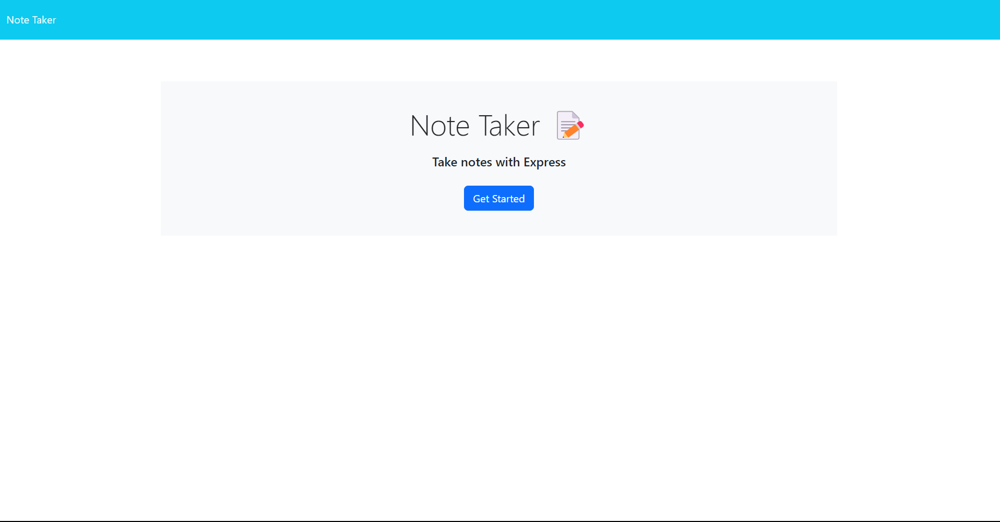
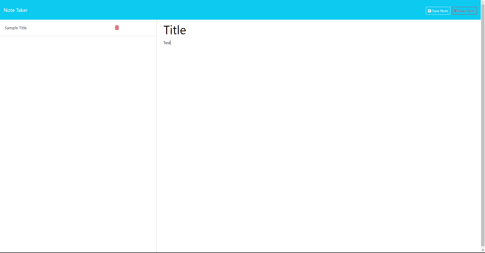

# Note Taker

## Description

The purpose of this project is to learn how to use Express as a means to create a web framework for creating servers used in a note taking application. The motivation for this project was to solidify an understanding of Express.JS and how server routing is used for GET and POST requests. This project was built to create a note taking application that uses back-end server databases created using Express. The problem this project solves is creating an application that uses a developer generated server and API for back-end development. 

## Installation

N/A

## Usage

In order to use the application, the user may click on the link provided below. Another method to launch the application is via the integrated terminal and typing the command "node server" or "npm run start" and following the link provided in the console. Once users have reached the homepage of the application, a "Get Started" button can be clicked to navigate to the page used to take notes. Upon typing, users will note that a "save" icon appears once they have entered a note title and body; furthermore, a "Clear Form" button also appears if users wish to delete all text typed in the current note. After saving a new note, user history will stored on the left-hand side of the application. If the user wishes to view a previous entry, they may do so by clicking on any previous note. To delete an existing note, click on the red trash can icon stored to the right of a previously saved note. 

## Credits

ExpressJS for the web framework used in creating the API and server used in the application. Nodemon for the live development dev dependency used throughout the process to keep live updates while building the application. Megan Meyers for assitance in creating a "delete" feature to delete previously stored unwanted notes. 

## Link(s)

## Images

